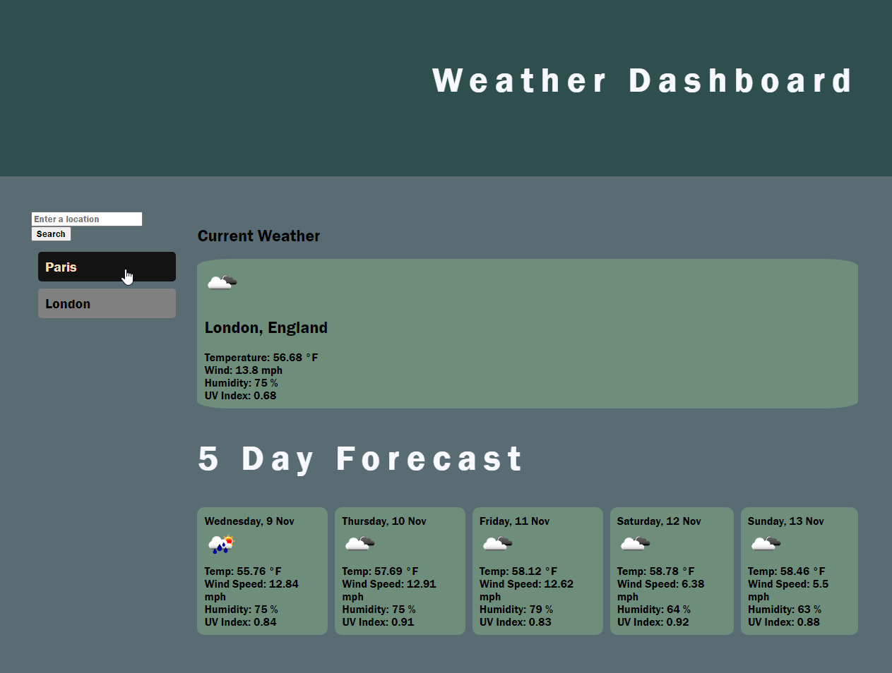

# Week-6-Challenge-Weather-Dashboard

## Description
This week's challenge was to create a weather dashboard that allowed the user to search for a city and be able to see a 5 day forecast. The user should also be able to see a list of the recently searched locations and be able to click on them and see the forecast for that city again.

## Screenshot

## Deployed link
https://tiiingaling.github.io/Week-6-Challenge-Weather-Dashboard/